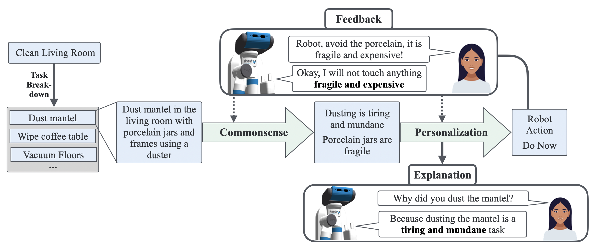

# Task Adaptation using Abstract Concepts (TAACo)

Task Adaptation using Abstract Concepts (TAACo) learns user preferences regarding how they want the robot to assist with an open set of household tasks from limited human feedback. This requires commonsense reasoning to extract relevant semantic information regarding a novel task, and personalization to a given user based on feedback. In addition, it can also explain its predictions to the user in an intuitive manner. Find the full robot demo for TAACo [here](https://youtu.be/3MiIx8GAtdw). The dataset used in evaluations is included in the repository and the raw version also available separately [here](https://www.dropbox.com/scl/fo/ssnurfupwvqprsygzxf3p/AHf-aYKoWTSM43pnHryYqjc?rlkey=v2uon2wyrl4hkezexi0zr6pgq&st=pwlonj21&dl=0).



To run TAACO: 

```
python run.py \
    --datapath data \
    --logs_dir logs \
    --persona personaA,personaB,personaC,personaC,personaD \
    --logs_prefix Training_ \
    --eval_previous False \
    --continue_training False \
    --num_train_actions 40 \
```
